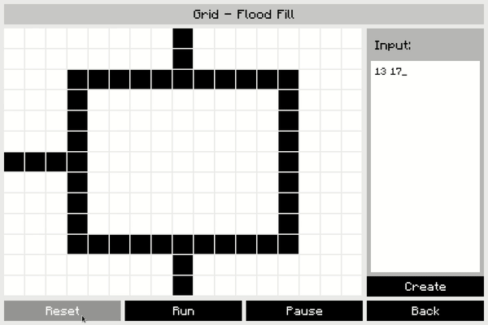
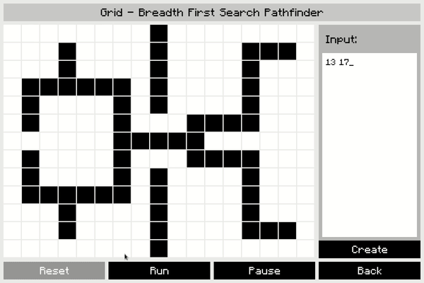
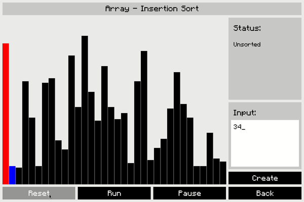
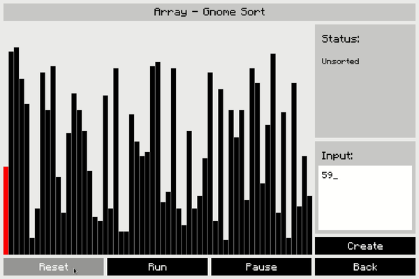
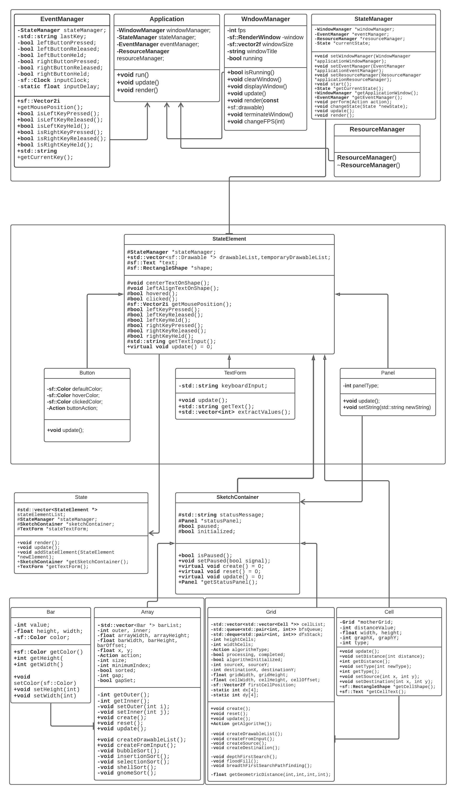

# AlgoVis

## Algorithm Visualization Showcase

AlgoVis is an interactive visualization tool designed to demonstrate the execution of various **sorting** and **grid-based** algorithms. It provides an intuitive way to analyze and understand algorithm behavior in real-time through animations and graphical representations.

## Algorithm Demonstrations

### Flood Fill in a 2D Grid
Flood Fill algorithm demonstrates how an area can be recursively filled starting from a given point, similar to a paint bucket tool in image editors.

### Pathfinding with BFS in a 2D Grid
Breadth-First Search (BFS) finds the shortest path in an unweighted grid, useful for pathfinding in navigation systems and AI applications.

### Insertion Sort
Insertion Sort builds a sorted array one element at a time, efficiently handling small datasets and nearly sorted data.

### Shell Sort
Shell Sort extends Insertion Sort by comparing distant elements to reduce total comparisons, significantly improving efficiency.

### Gnome Sort
Gnome Sort swaps misplaced elements while iterating, behaving similarly to Insertion Sort but without pre-determined gap sequences.

## Features
- **Custom-sized array and 2D grid visualization** for dynamic exploration.
- **5 sorting algorithms** and **3 grid algorithms** with real-time visualization.
- **Speed control** to adjust algorithm execution rate.
- **Pause and resume functionality** to analyze the algorithm at any step.
- **Interactive interface** to select different algorithms and customize input data.

## How to Build and Run
For detailed setup instructions, refer to the [Build Guide](/BUILD.md).

## Known Bugs
- Speed control is tied to **FPS adjustments**, leading to occasional UI lag.
- Handling **large data structures** increases **memory usage**, causing slowdowns.

## Planned Enhancements
- **Custom graph creation** for interactive graph-based problem-solving.
- **Tree-like data structures** for additional algorithm demonstrations.
- **Graph and tree algorithms** such as DFS, Dijkstra’s, and A* pathfinding.
- **Optimized rendering** to reduce performance overhead.

## UML Diagram
A structured overview of the AlgoVis system architecture.

## Contributions
We welcome contributions! Feel free to fork the repository, submit pull requests, or report issues. Your ideas and improvements can help expand AlgoVis.

## License
This project is licensed under the **MIT License**.

